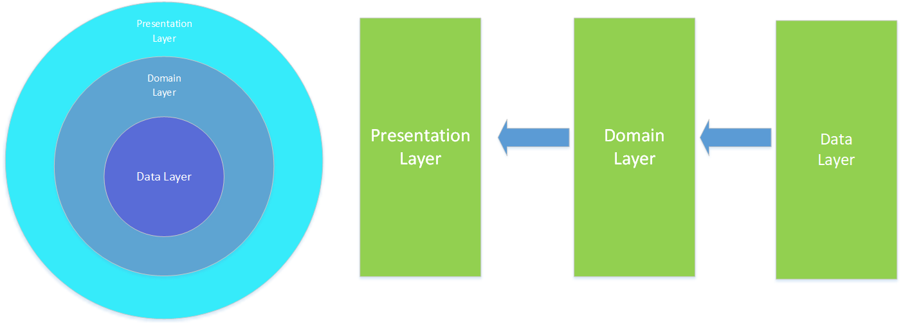
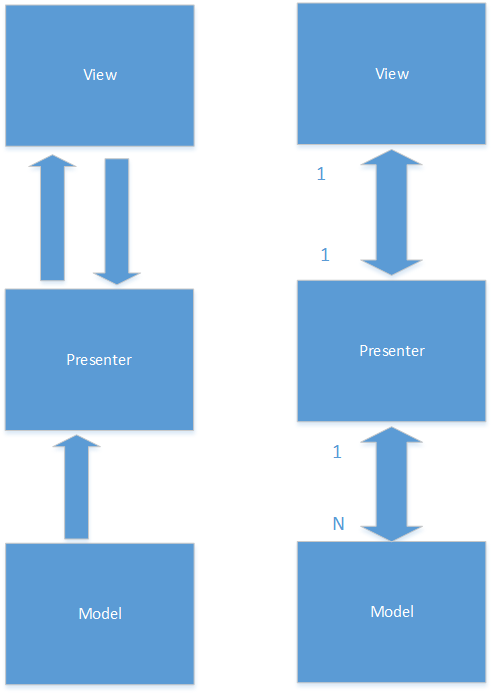
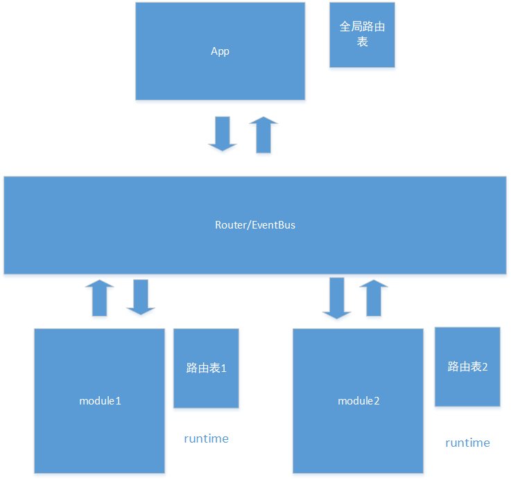

FastAndroidProject
=====
这是一个旨在快速、安全、可维护的Android开发工程。该工程以Robert C. Martin的Clean Architecture为指导思想，MVP模式表现层来设计的。
设计图如下

架构流向

MVP结构

module通信

Framework
--------
* **uicore**: 内置默认视图样式、视图标准以及视图库
注：dialog创建必须通过DialogFactory进行处理
* **core**:包含通用工具类、图片加载、权限等
* **third-party**:包含第三方框架，一般屏蔽原始第三方实现方式。

&nbsp;&nbsp;&nbsp;&nbsp;&nbsp;&nbsp;注：第三方框架不等于第三方库，例如支付等为第三方框架、RxJava不是.

&nbsp;&nbsp;&nbsp;&nbsp;&nbsp;&nbsp;特殊情况：

&nbsp;&nbsp;&nbsp;&nbsp;&nbsp;&nbsp;微信支付，支付宝等这类属于独一无二的使用，这种不需要wrapper，直接使用即可。
面部识别，一般IM等其他平台也有具体实现，为了方便替换，才需要wrapper

* **Log**:日志打印等。
* **router**: activity跳转协议

Domain
--------
领域模块，文件以XXXCase命名，实现app所有业务

Repository
--------
数据层，对外只提供接口和data对象

extension
---------
扩展层，用于第三方、UI、core等整合

Core Support
--------
* **RxJava**:流式处理异步 [link][1]
* **RxAndroid**: 一个RxJava在Android的库 [link][2]
* **Logger**:阅读性强的日志打印 [link][3]
* **OkHttp**: 网络请求 [link][4]
* **Retrofit**:符合Restful调用方式的OkHttp增强库 [link][5]
* **GSON**:一个Json转Bean的库 [link][6]
* **Android Library**:google官方的工具库
* **Glide**: 图片加载框架[link][7]
* **Flight**: Android 路由器
* **presentation**: MVP和MVC快速开发
* **bean**: 最原始工厂模式
* **common**: 公共工具库

Thanks
--------
感谢Robert C. Martin  提供的Clean Architecture思想。
感谢发布开源库的组织和个人

[1]:https://github.com/ReactiveX/RxJava
[2]:https://github.com/ReactiveX/RxAndroid
[3]:https://github.com/orhanobut/logger
[4]:https://github.com/square/okhttp
[5]:https://github.com/square/retrofit
[6]:https://github.com/google/gson
[7]:https://github.com/bumptech/glide
